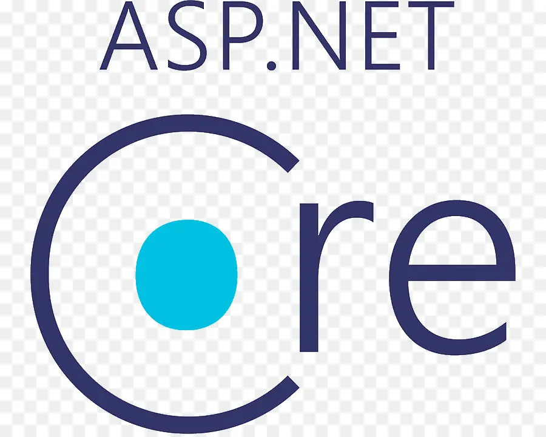
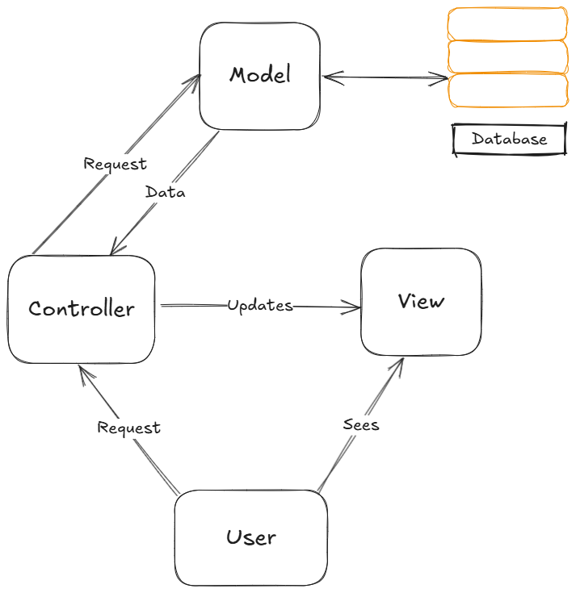
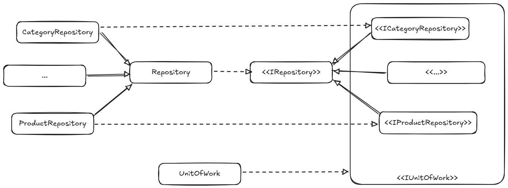

# Sport World

# Overview

Sport World is a online store project that sells sport equipments. Sport World offers the following features:

- **Search/filter Products**: Easily find your favourite sport gears by searching by name or filtering by categories. 
- **Shopping Cart**: Keeps track of all products that customers have added. The cart will display the quantity, price of each product, and the total price of the order.
- **Payment**: Secured online payment with a wide range of card brands supported.
- **Order tracking & Email**: Tracks order status and automatically send notifications via email to customers about order updates.
- **Authorisation**: Provide multiple user types (admin, employee, company, customer) with corressponding access and functionality.
- **Order Management**: Allow admin/employee users to view and process customer orders. All updated details (such as tracking number, courrier number, etc.) will be displayed in customer side.
- **Product Managements**: Allow admin users to view and add/update/delete products which will automatically be updated in the home page.

You can access the website here: [https://sportworld.azurewebsites.net/](https://sportworld.azurewebsites.net/). **(The site will take 2-3 minutes to start up)**

Please use this [credentials](documents/credentials.txt) to log in as **admin** and access all functionalities of the website.

# Tech Stack 

     ASP.NET Core |
     Azure Cloud |
     GitHub Actions

# Architecture & Design Patterns

## Model-View-Controller Architecture
Sport World uses the Model-View-Controller architecture to separate the application into specific layer of concerns:

- **Model**: Contains database schema and implementation of accessing data.
- **View**: Contains the application's user interface and layouts.
- **Controller**: Defines all application logic and handle user request to update views.

 

<i>Model-View-Controller Diagram</i>

## Repository and UnitOfWork Pattern
Sport World also implements the Repository and UnitOfWork Pattern to provide an abstract layer over data accessing.

**Implementaion Details:**
- Each table/aggregate root is a repository with name format `(TableName)Repository`.
- All repositories are child of the `Repository` class. This `Repositories` class contains the implementation of all repositories' common methods.
- Each repository can have its own unique method, which is abstracted in its corresponding interface `<<I(TableName)Repository>>`.
- The `UnitOfWork` class implements `<<IUnitOfWork>>` interface, which contains all repositories interfaces.
- The `<<IUnitOfWork>>` interface is exposed to client for accessing the repositories.

**Advantages:**
- The implementation better follows the Dependecy Inversion principle (programming against abstraction not concretion).
- It makes testing more feasible as the code is not coupled to Entity Framework.
- Only expose needed functionality by abstracting away `IQueryable`.

 

<i>Repository & UnitOfWork Implementation Diagram</i>

